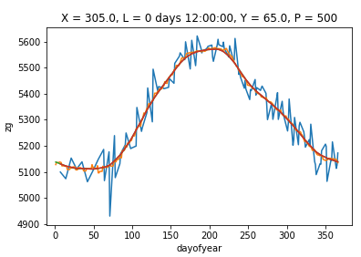

README
------

This repository contains python code for creating daily climatologies of SubX data.

This code assumes you have used the code in `download_data/` to generate the files.

 - The shell script ``generate_ts_clim.ksh`` will generate a python scripts to create a climatology. The code is split into two sections with on/off switches via ``gen_clim`` and ``smooth_clim``. It recommended to run one section as a time to reduce memory usage. 

To setup and run:

.. parsed-literal:: 
 
    $ # edit variables in generate_ts_clim.ksh
    $ ./generate_ts_clim.ksh
    $ # python create_ts_climatology.py
    $ # Swtich smooth_clim on and gen_clim off
    $ # python create_ts_climatology.py    

